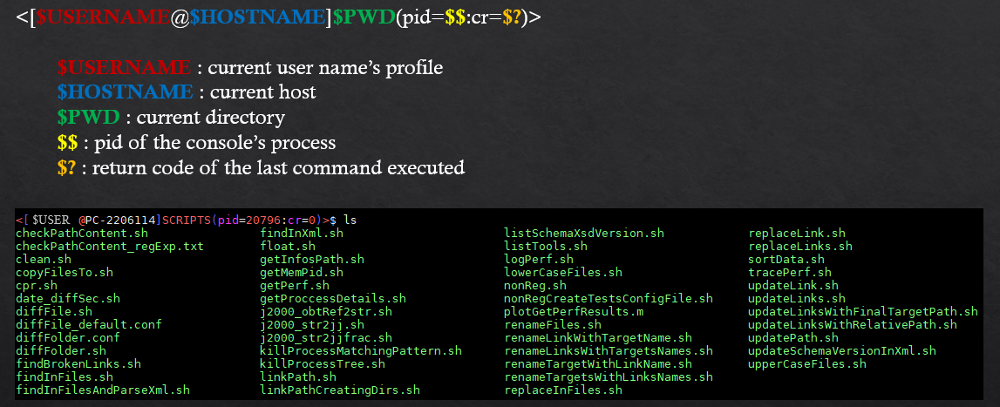

Here is my set of scripts and the configuration i use under Linux.

#	PROMPT

# ALIASES

- h='history' 
- mkdir='mkdir -pv' 
- meminfo : (see env.sh) get memory informations and the first 10 most demanding processes 
- cpuinfo='lscpu'
- cpr='cpr.sh' 
- cpl='cp -rL' 
- getAllMyProc='ps -eaf | grep -v "grep" | grep '$USER 
- getAllMyChildProc='ps -eaf | grep -v "grep" | grep '$USER' | grep '$$
- getChildProc='pgrep -l -P '$$
- size='sudo du -hs' ( !!! sudo users only !!!)
- rexplorer='sudo nautilus --no-desktop --browser' ( !!! sudo users only !!!)
- clear : (see env.sh) clear console screen 

# AVAILABLE SCRIPTS

See above or launch **./SCRIPTS/listTools.sh** to get the list

Most interesting scripts are : 

**killProcessTree.sh** : kill a process tree (process and his subprocesses) "softly"
It search for final childs in the process tree, kill them from the softly to the harder (kill -9) and treats the processes' stack backwardly.

**killProcessMatchingPattern.sh**

**findInFiles.sh, replaceInfiles.sh, renameFiles.sh** : what every OS should have...

**linkPath.sh and linkPathCreatingdirs.sh** : used to create links trees. The difference reside in  : for the last one, it re-creates the relative path 
using folder and so do not corrupt the source location if you create file in there.

**findBrokenLinks.sh replaceLink.sh and replaceLinks.sh** : detect broken links, replace link(s) with their target

**updateLink.sh and updateLinks.sh** : to change the target location of a link (broken or not) 

**diffFile.sh and diffFolder.sh** : diff tools that can ignore lines/nodes in ASCII files (powerfull on XML files with the ability of ignoring nodes order)

**checkPathContent.sh** : tool to validate a path (files and folder in) based on regular expression

Symlinks handling scripts allow to create your own configuration management tool. If you manipulate "big data", it alllows you to not duplicate them on your disk.

- linkPathCreatingdirs.sh : create your "trunk" tree containing only symlinks to files.
- replaceLink(s).sh : acts like a "checkout" if you need to modify a file
- updateLink(s).sh : update symlinks if you moved targets

# INSTALL

Launch **install.sh**

It will add a line in your bashrc to source the tool box.

Linux Tool Box is added to your path so the scripts are available everywhere.

# UNINSTALL

Remove the line in your bachrc under # sourcing linux tool box
